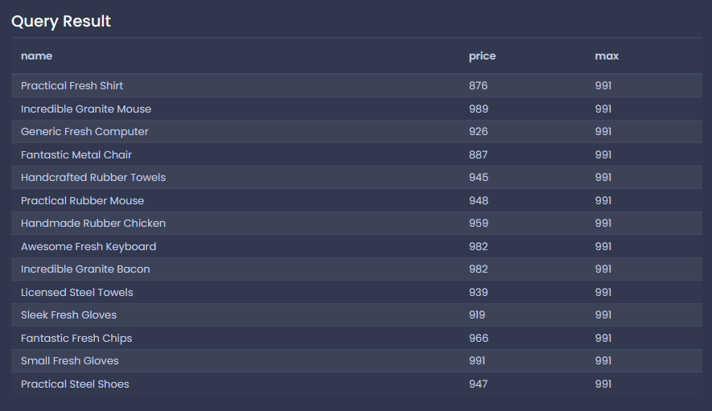

# 서브쿼리를 통해 쿼리 합치기

어떤 쿼리 결과를 가지고 또 쿼리해서 값을 가져와야할 때가 있다.

```sql
SELECT
  name,
  price
FROM
  products
WHERE
  price > (
    SELECT
      MAX(price)
    FROM
      products
    WHERE
      department = 'Toys'
  );
```

이런 식으로...

## 데이터의 구조를 생각해봅시다

서브쿼리 4개가 괄호안에서 연산되어 나오고 그걸 가지고 최종쿼리를 하는 수도 있다. 이런 케이스가 실제로 있겠지...

- 아래 각들을 구하기 위해 쿼리하기도 한다
  - 값의 소스
  - 레코드(row)의 소스
  - 컬럼의 소스

### 쿼리결과의 형태는 키라는 것을 이해합시다.

- `SELECT * FROM orders` -> 여러 레코드와 여러 컬럼을 가져옴
- `SELECT id FROM orders` -> 여러 레코드와 하나의 컬럼을 가져옴
- `SELECT COUNT(*) FROM orders` -> 하나의 레코드와 하나의 컬럼을 가져옴(단일값, 스칼라 쿼리)

## `SELECT` 구문에서의 서브쿼리

```sql
SELECT
  name,
  price,
  (SELECT MAX(price) FROM products) -- as max_price 구문 추가가능
FROM
  products
WHERE price > 867;
```

저 값에 해당하는 스칼라값을 컬럼에 그냥 다 넣어버림.



```sql
select
    name,
    price,
    price / (select max(price) from phones) as price_ratio
from phones
```

## `FROM` 구문에서의 서브쿼리

바깥의 쿼리내용하고 **호환가능** 해야한다.

서브쿼리 내용은 `AS`를 통한 alias를 꼭 가져야한다.

```sql
SELECT
  name,
  price_weight_ratio
FROM
  (
    SELECT
      name,
      price / weight AS price_weight_ratio
    FROM
      products
  ) AS p
WHERE
  price_weight_ratio > 5;
```

왜 서브쿼리 처리를 한 것인지 살펴보자.

일단, 문제를 풀기위한 쿼리는 여러가지가 있을 수 있다. 그 중 해결책이 서브쿼리일 수도 있다.

실제 쿼리를 하기위한 선행과정을 해둬야 한다. 이 과정을 통해 필요한 데이터를 미리 구해둔다고 보면 된다.

E.g., `AVG(COUNT(*))` 이런 쿼리는 안먹히기 때문에 풀어둘 필요가 있다. 이걸 하고싶으면 서브쿼리를 해야한다.

```sql
SELECT AVG(p.order_count)
FROM
  (
    SELECT
      user_id,
      COUNT(*) AS order_count
    FROM
      orders
    GROUP BY
      user_id
  ) as p
```

-> 스칼라 값이 나옴!

```sql
SELECT
  MAX(p.avg_price) as max_average_price
FROM
  (
    SELECT
      AVG(price) as avg_price
    FROM
      phones
    GROUP BY
      manufacturer
  ) as p
```

## `JOIN` 구문에서의 서브쿼리
